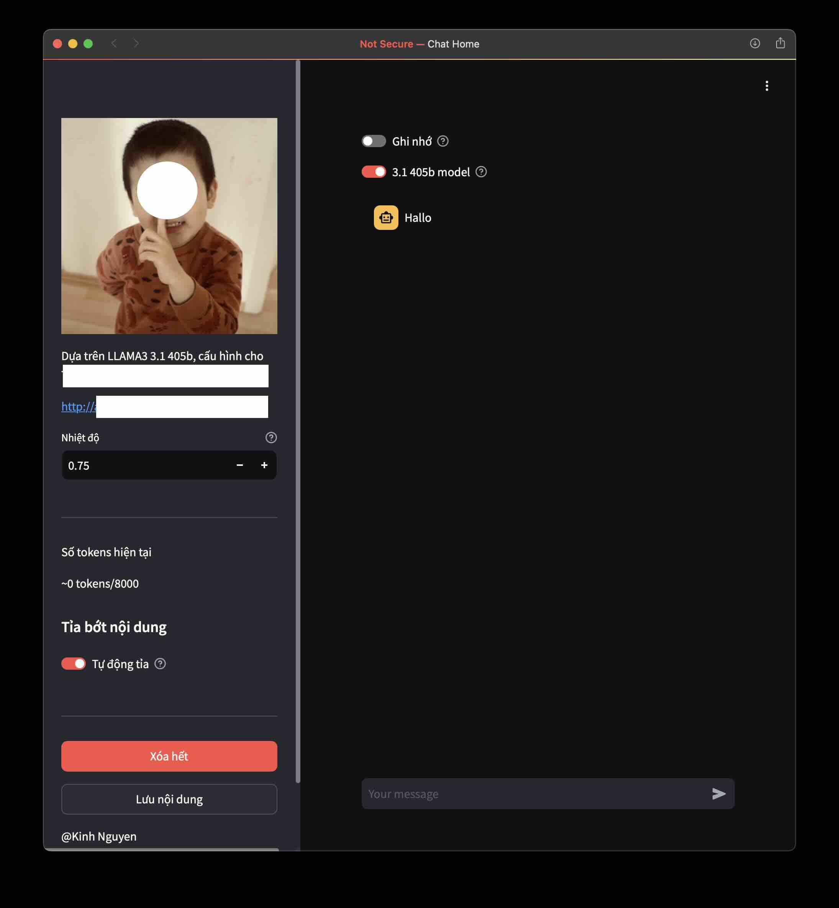

# HomeChat - v0.001

Webapp đơn giản để tự host chạy mô hình meta-llama3

- Cần `streamlit` API token, tùy bạn cách nào để code nó (lưu vô `./.streamlit/`) chẳng hạn.
- Tùy chọn `system_prompt` để hướng dẫn cách trả lời, code này mở nên không code hướng dẫn hệ thống.
- Thêm `logo.jpg` vào mới chạy được

TODO

- [ ] thêm tùy chọn mô hình
- [ ] thêm các tùy chọn khác ngoài nhiệt độ
- [x] thêm mô hình 405b
- [x] thêm cách quên (giảm tối thiểu số tokens khi các câu hỏi không cần thông tin từ nội dung hỏi đáp trước đó)
- [x] tự động tỉa tokens
- [x] tỉa chủ động tokens
- [ ] thêm cách nén nội dung thay vì tỉa
- [x] tùy chọn lưu nội dung trò chuyện
- [x] thêm mật mã truy cập

## Demo

